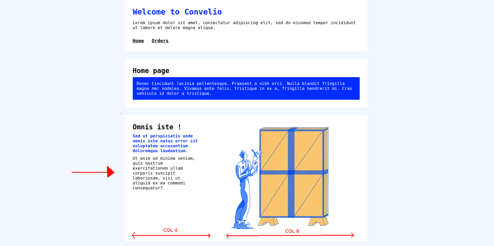

# Convelio Front Interview

This project was generated with [Angular CLI](https://github.com/angular/angular-cli) version 8.3.7.

## Development server

Run `npm run start` for a dev server. Navigate to `http://localhost:4800/`. The app will automatically reload if you change any of the source files.

## Git config

Create a new branch from `master` and call it `convelio-test`.

## Test

- Launch the app in a browser.

### SCSS and BEM part

*The CSS theme relies on SCSS and [BEM methodology](https://en.bem.info/methodology/quick-start/).* 

- Add a new block to the home page. It should look just like this:

Text content does not matter ; you will find the image in the assets ; use **existing classes**, the CSS theme already contains what is needed (typos, grid, ...).
- In the CSS theme : add a modifier to the `block-paragraph` element in order to display yellow text ; then use this modifier to add a paragraph with yellow text to the new block you just created in the home page.
- Write down the CSS classes compiled from `_block.scss`. You can write it in the `BLOCK-CSS-CLASSES.md` file.
- Commit your changes and push it on your new branch.

##### BONUS
- The grid system works well but the `col-` classes are missing some rules to be fully responsive. Add those rules in the CSS theme ; you may use **existing mixins**.
- Commit your changes and push it on your new branch.

### Angular part
- Display order details on the `OrderDetail` page : `number`, `from`, `to`, `price`. **Use existing routing** (you may add logic to it using *existing files*...).

> No design model here so you're free to integrate it as you wish but try to make it "look like" the other pages as much as possible.
- Create the `OrderModel` (in the `models` folder) and type objects where needed.
- Commit your changes and push it on your new branch.

##### BONUS
- Create two pages : one to display the list of `Drafts` (see `/assets/data.json`), and one to display the details of a specific `Draft`. You may rely on the existing app structure (`services`, `routing`, `modules`, ...).
- Commit your changes and push it on your new branch.

## Code scaffolding

Run `ng generate component component-name` to generate a new component. You can also use `ng generate directive|pipe|service|class|guard|interface|enum|module`.

## Further help

To get more help on the Angular CLI use `ng help` or go check out the [Angular CLI README](https://github.com/angular/angular-cli/blob/master/README.md).
